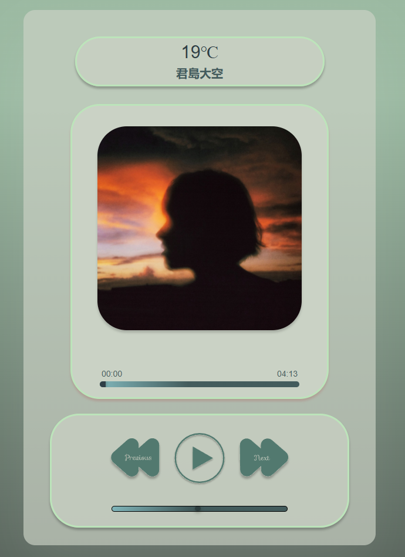

# MimiPlayer

# 🎵 MimiPlayer

A responsive, stylish music player built with HTML, CSS, and JavaScript.

---

## ✨ Features
- Play / Pause songs
- Next / Previous song
- Progress bar with time
- Volume control
- Album cover display
- Fully responsive design (works on mobile & desktop)

---

## 🚀 Demo
Check the live version here:  
👉 [Live Demo](https://mimiplayer.netlify.app/)

---

## 📸 Screenshots

---

